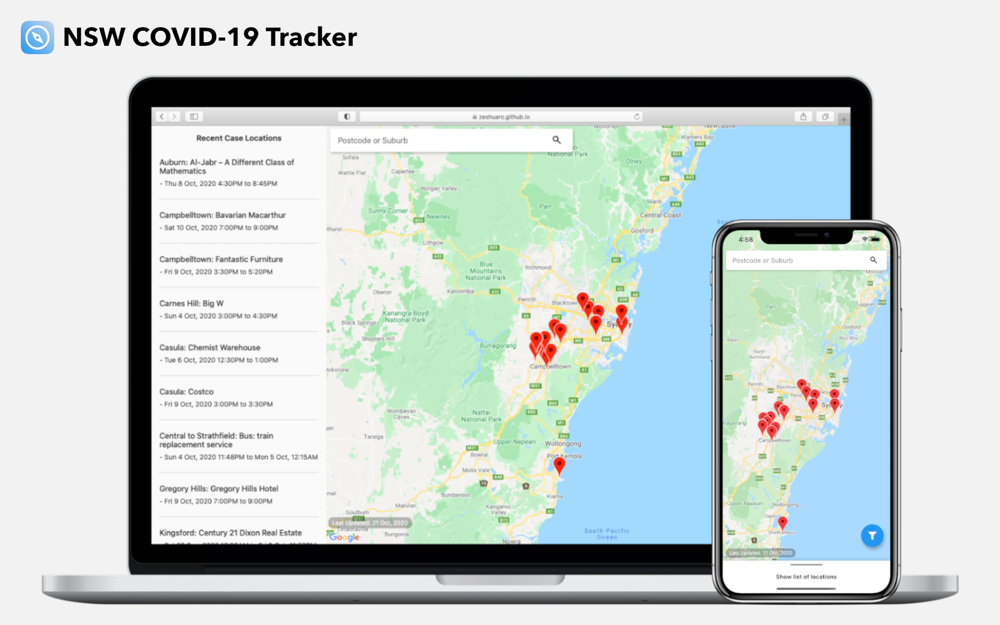

# NSW COVID-19 Tracker

Before you visit a suburb, search if there have been any active cases in those public locations.

## Getting Started

### Setup Flutter

To install and setup Flutter, follow the instructions [here](https://flutter.dev/docs/get-started/install).

### Setup Firebase

Create a new project on Firebase.

- For iOS, create an iOS app and download the config file `GoogleService-info.plist`, and place it under `ios/Runner/`. Open Xcode and select `ios/Runner/Runner.xcworkspace` to open it as the project. Drag the config file into Xcode under `Runner` and make sure to add it to all targets.
- For Android, create and Android app and download the config file `google-services.json`, and place it under `android/app/`.

#### Authentication

Enable Anonymous sign in in the Authentication tab.

#### Realtime Database

Enable Realtime Database by going into the corresponding tab.

#### Service Account

Create a service account by going into Settings > Project settings > Service accounts > Firebase Admin SDK > Generate new private key. Rename the file to `keyfile.json` and place it under `functions/`.

### Setup Google Maps

Follow the instructions [here](https://pub.dev/packages/google_maps_flutter#getting-started) to setup Google Maps.

### Setup Database

We provide some Python scripts to fetch and add data into the database. The scripts require Python 3.6+. 

Install the required packages with the command below:

    cd functions/
    pip3 install -r requirements.txt

Then run the following commands to fetch and add all the data:

    python fetch_data_old.py  # For fetching the outdated data
    python main.py            # For fetching the latest data

### Setup and Running the App

Navigate back to the root of the project and run the command below to install the Flutter packages:

    flutter pub get

Run the code generator:

    flutter pub run build_runner build

Run the app:

    flutter run
